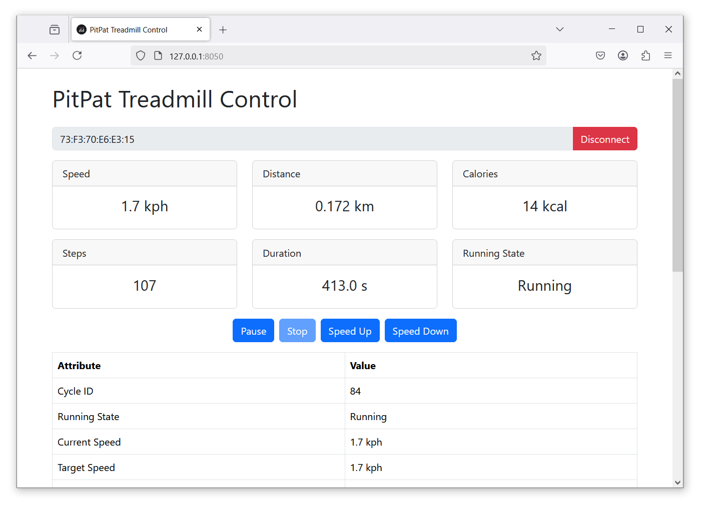

# PitPat Treadmill Control



A Dash-based web application to control and monitor a PitPat treadmill via Bluetooth. This unofficial tool provides real-time data visualization and basic treadmill control through an intuitive web interface.

---

## Features

- Automatic discovery of nearby PitPat treadmills (no need to remember the address)
- Bluetooth connectivity to PitPat treadmills
- Real-time monitoring of treadmill metrics
- Control commands (start, stop, speed adjustments)
- Detailed status table
- Responsive Bootstrap-styled UI
- Docker support for easy deployment

---

## Getting Started

### Prerequisites
- **Python 3.9+** (for local installation)
- **Docker** (optional, for containerized deployment)
- **Bluetooth-enabled device** with appropriate permissions

### Installation

#### Local Installation
1. Clone the repository:
   ```bash
   git clone https://github.com/azmke/pitpat-treadmill-control.git
   cd pitpat-treadmill-control
   ```
2. Install dependencies:
   ```bash
   pip install -r requirements.txt
   ```

#### Docker Installation
1. Clone the repository:
   ```bash
   git clone https://github.com/azmke/pitpat-treadmill-control.git
   cd pitpat-treadmill-control
   ```
2. Build and start with Compose (recommended — it wires up the Bluetooth D-Bus
   socket, the log directory and the port for you):
   ```bash
   docker compose up -d --build
   ```
   Or build the image by hand:
   ```bash
   docker build -t pitpat-treadmill-control .
   ```

### Running the Application

#### Local Usage
Start with default settings:
```bash
python main.py
```

Customize with parameters:
```bash
python main.py --host 127.0.0.1 --port 8050 --debug
```

#### Docker Usage
With Compose:
```bash
docker compose up -d --build   # build and start
docker compose logs -f         # follow the logs
docker compose restart         # after a code change: add --build
docker compose down            # stop and remove
```

`docker-compose.yml` publishes the dashboard on `127.0.0.1:8050`, reachable from this
machine only. Change the `ports:` entry to `"8050:8050"` to expose it to the network,
and add extra flags (such as `--debug`) to the `command:` list.

Or run the container by hand — note that the D-Bus mount is required, without it the
app can neither scan nor connect:
```bash
docker run -d \
  -p 8050:8050 \
  -v /run/dbus/system_bus_socket:/run/dbus/system_bus_socket \
  --name pitpat \
  pitpat-treadmill-control \
  --host 0.0.0.0 \
  --port 8050 \
  --debug
```

Access the dashboard at `http://localhost:8050`.

---

## Finding Your Treadmill

The dashboard scans for treadmills automatically when the page loads, and the **Scan**
button next to the address field repeats the scan on demand. A scan takes about 8
seconds.

- If exactly one treadmill is found, its address is filled in for you — just press
  **Connect**.
- If several are found, click the address field to pick one from the suggestion list.
- The address field still accepts a manually typed address.

Devices are matched on their advertised vendor service (`fba0` or the `ff00` family) or
on a name containing "PitPat" or "T01". On Linux, treadmills BlueZ already knows about
are listed too, even when a stale connection is stopping them from advertising —
connecting drops that link first.

---

## Functionality

### Supported Metrics
The dashboard displays the following treadmill metrics:

| Metric                | Description                              | Unit                  |
|-----------------------|------------------------------------------|-----------------------|
| Cycle ID             | Unique session identifier                | -                     |
| Running State        | Current state                            | Starting/Running/Paused/Stopped |
| Current Speed        | Current speed                            | kph or mph            |
| Target Speed         | Desired speed setting                    | kph or mph            |
| Maximum Speed        | Maximum allowed speed                    | kph or mph            |
| Current Incline      | Current incline angle                    | Degrees (°)           |
| Target Incline       | Desired incline setting                  | Degrees (°)           |
| Maximum Incline      | Maximum allowed incline                  | Degrees (°)           |
| Heart Rate           | User's heart rate (if supported)         | bpm                   |
| Distance             | Total distance traveled                  | km or miles           |
| Steps                | Number of steps taken                    | -                     |
| Calories             | Estimated calories burned                | kcal                  |
| Duration             | Session duration                         | HH:MM:SS              |
| WIFI Connected       | Wi-Fi connection status                  | True/False            |
| Motor Rotation Speed | Motor speed                              | rpm                   |
| Motor Load           | Motor load percentage                    | %                     |
| Serial Number        | Treadmill serial number                  | -                     |
| Firmware Version     | Current firmware version                 | -                     |
| Device Type          | Treadmill model identifier               | -                     |
| Unit Mode            | Measurement system                       | Metric/Imperial       |

### Supported Control Commands
The following commands can be sent to the treadmill:

| Command     | Description                          | Effect                  |
|-------------|------------------------------|---------------------------------|
| Start       | Begins or resumes operation  | Starts treadmill if stopped/paused |
| Pause       | Pauses the treadmill         | Pauses if running               |
| Stop        | Stops the treadmill          | Stops if paused                 |
| Speed Up    | Increases speed              | +0.1 kph/mph if running         |
| Speed Down  | Decreases speed              | -0.1 kph/mph if running         |
| Set Speed   | Jumps straight to a speed    | Type a value and press **Set**; clamped to the treadmill's maximum, running only |

---

## Compatible Devices

The following treadmill models have been tested with this application.

- Pitpat T01 (BA04)
- Pitpat T01, firmware 37 (`fba0` service variant) — **requires the patches described in
  [docs/FIRMWARE-VARIANT.md](docs/FIRMWARE-VARIANT.md).** Different GATT characteristics and
  no transport wrapper; on an unpatched checkout it connects but shows no data and the
  control buttons silently do nothing.

Help us expand this list by reporting your compatible devices via an [issue](https://github.com/azmke/pitpat-treadmill-control/issues) or pull request:

---

## Additional Notes

### Bluetooth Access
- Ensure Bluetooth is enabled on the host system.
- For Docker on Linux, mount the D-Bus system bus socket — `docker-compose.yml` already
  does. bleak talks to the host's `bluetoothd` over D-Bus and never touches the HCI
  device, so no `--privileged`, `--net=host`, or `CAP_NET_ADMIN` is needed:
  ```bash
  docker run -d -p 8050:8050 \
    -v /run/dbus/system_bus_socket:/run/dbus/system_bus_socket \
    pitpat-treadmill-control
  ```
  The same socket covers scanning; the container runs as root, which BlueZ's D-Bus
  policy allows to call both `StartDiscovery` and the GATT interfaces.
  (A `--device=/dev/rfcomm0` flag does nothing useful here — rfcomm is Bluetooth Classic
  serial, whereas this app uses BLE GATT.)
- Do not connect the treadmill from your desktop's Bluetooth panel. A BLE device stops
  advertising while connected, which makes the app's scan fail with a misleading
  `was not found`. Pairing is not required. See
  [docs/FIRMWARE-VARIANT.md](docs/FIRMWARE-VARIANT.md#6-troubleshooting).

### Logging
- Logs are stored in the `logs/` directory (locally or within the container)
- Rotating log files with a maximum size of 1MB and 5 backups

---

## Contributing

We welcome contributions! To get started:
1. Fork the repository
2. Create a feature branch: `git checkout -b feature/your-feature`
3. Commit your changes: `git commit -m "Add your feature"`
4. Push to the branch: `git push origin feature/your-feature`
5. Open a Pull Request

For bugs or feature requests, please open an [issue](https://github.com/azmke/pitpat-treadmill-control/issues).

---

## License

This project is licensed under the [MIT License](LICENSE). See the `LICENSE` file for details

---

## Disclaimer

This project is an independent, unofficial tool and is **not affiliated with, endorsed by, or associated with PitPat or JOYFIT INC**. It was developed from scratch for non-commercial, personal experimentation and educational purposes, based solely on publicly observable interactions with PitPat treadmills to enable interoperability. No proprietary code, assets, or intellectual property from PitPat or JOYFIT INC have been used or incorporated. This tool is not intended to bypass security measures or violate any terms of service. This software is provided 'as-is', without any warranties, express or implied, and the author assumes no responsibility for any damage, malfunction, or warranty issues resulting from its use. Use at your own risk and ensure compliance with applicable laws and terms of service.